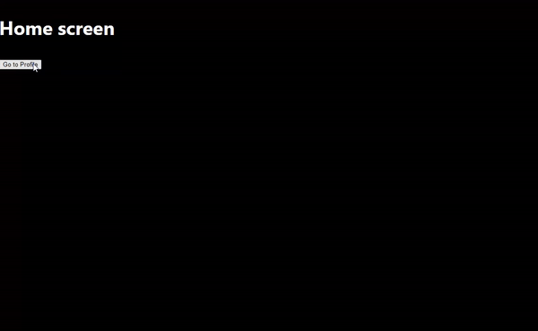

# astro-react-navigation

Integrate [React Navigation](https://reactnavigation.org/) to create a hybrid routing solution for Astro multi-page apps.

Part of a long-term experiment to create a universal next-gen router with the following features:

- Isomorphic (hybrid SSR + client-side routing)
- React framework-agnostic (initially with tight integration to Astro/Vite SSR)
- First-class support for common mobile navigation patterns such as tabs, stacks, segments, modals, etc. [Reference](https://frankrausch.com/ios-navigation)
- Support RSC streaming, layouts & nested layouts [TODO]
- 100% ESM-only exports [TODO]

## Usage

### 1. Installation

Create a [new Astro project](https://docs.astro.build/en/tutorial/1-setup/2/) or cd into an existing project. Ensure the
[Astro React plugin](https://www.npmjs.com/package/@astrojs/react) is installed, and then run the following commands (see
note on alternate package managers below if not using pnpm):

- `pnpm add astro-react-navigation @react-navigation/native@next @react-navigation/stack@next
react-native@npm:react-native-web-lite react-native-safe-area-context@npm:react-native-safe-area-context-web-vendored`
- `pnpm add -D babel-preset-expo`

Then add the following to your `astro.config` file:

```
import react from "@astrojs/react";
import reactNavigation from "astro-react-navigation";

plugins: [
    // Load the Astro React plugin first
    react({
        // This option should be omitted or explicitly set to false
        // because it triggers a bug in the way Astro resolves virtual
        // children nodes in React
        // experimentalReactChildren: false
    }),
    reactNavigation()
]
```

Finally, do this hacky workaround in a `.pnpmfile.cjs` in your project root
(alternatively use npm overrides or yarn resolutions respectively if using either of these
package managers):

```
// It's currently necessary to override the @react-navigation/elements deps required
// by @react-navigation/stack, because of some dodgy cjs asset imports which break the
// production build.
// Yarn users could put this package resolution inside `resolutions` within `package.json`
// instead.

function readPackage(pkg) {
    if (pkg.dependencies && pkg.dependencies["@react-navigation/elements"]) {
        pkg.dependencies["@react-navigation/elements"] = "github:jkhaui/react-navigation-lite#react-navigation-elements-v2.0.0-alpha.10-gitpkg"
    }
    return pkg
}

module.exports = {
    hooks: {
        readPackage
    }
}
```

## Post-Install Quickstart

1. Create a `/react/index.tsx` file in your project root and paste the following:

```
import * as React from 'react';
import {DarkTheme, NavigationContainer} from '@react-navigation/native';
import {createStackNavigator} from '@react-navigation/stack';
import {SafeAreaProvider} from 'react-native-safe-area-context';

function Home({navigation}) {
    return (
        <div style={{flex: 1, justifyContent: 'center', alignItems: 'center'}}>
            <h1>Home screen</h1>
            <button
                children="Go to Profile"
                onClick={() => navigation.navigate('Profile')}
            />
        </div>
    );
}

function Profile({navigation}) {
    return (
        <div style={{flex: 1, justifyContent: 'center', alignItems: 'center'}}>
            <h1>Profile screen</h1>
            <button children="Go back" onClick={() => navigation.goBack()}/>
        </div>
    );
}

const Stack = createStackNavigator();

function MyStack() {
    return (
        <Stack.Navigator
            screenOptions={{
                headerShown: false,
            }}
        >
            <Stack.Screen
                name="Home"
                component={Home}
            />
            <Stack.Screen
                name="Profile"
                component={Profile}
            />
        </Stack.Navigator>
    );
}

export default function App() {
    const INITIAL_METRICS = {
         frame: {x: 0, y: 0, width: 0, height: 0},
         insets: {top: 0, left: 0, right: 0, bottom: 0},
    };

    return (
        <React.Fragment>
            <SafeAreaProvider initialMetrics={INITIAL_METRICS}>
                <NavigationContainer theme={DarkTheme}>
                    <MyStack/>
                </NavigationContainer>
            </SafeAreaProvider>
        </React.Fragment>
    );
}
```

2. From your root Astro page, and be sure to add the `client:load`
directive for immediate client-side hydration.

```
---
import App from "../components/react";
---

<App client:load />
```

You should now have the (very basic) example below working in your browser:



## Caveats

This integration is for a fairly specific/niche use-case. It's only been tested with SSR and you probably shouldn't use
it as-is in production. If the project actually progresses then it may one day have unit + e2e tests with appropriate
test coverage.

## Options

```
// Basic CSS applied to the page's HTML & body elements
// to ensrue the rendered navigation container does not initialize with a 
// height of 0.
// Defaults to true. 
injectGlobalStyles?: boolean;

// See https://github.com/expo/router/blob/d234a3237afa3595a5b30c595522b2ff7f296750/packages/expo-router/src/static/renderStaticContent.tsx#L23.
// Defaults to true.
resetGlobalElementsContext?: boolean;
```